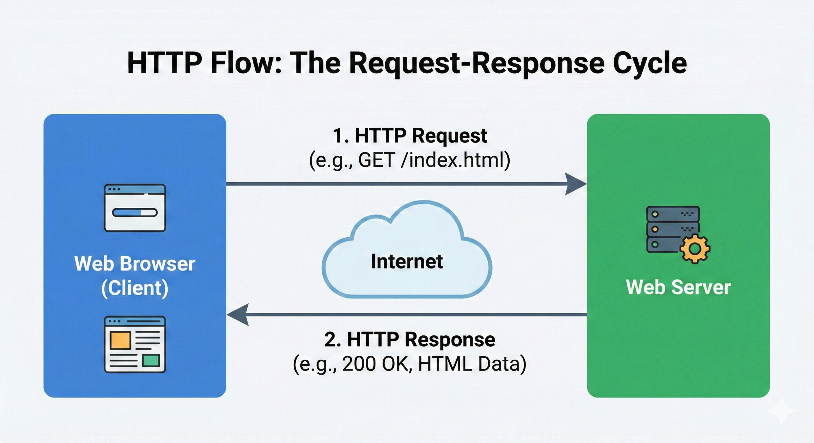
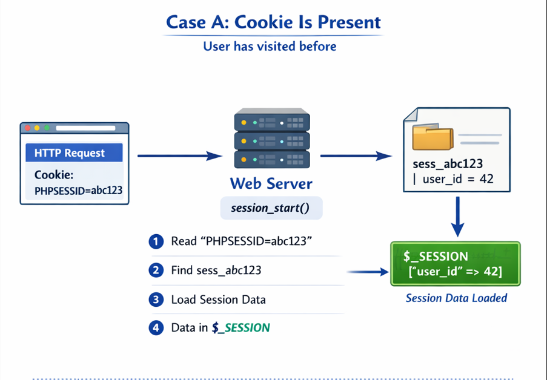
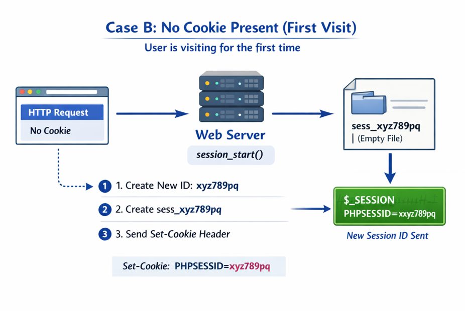

# How PHP Sessions Actually Work — From Browser Request to Final Response

## Section 1 — Introduction

Before we understand how PHP sessions work, we need to understand something more fundamental:

**How a browser and a server actually talk to each other over the internet.**

Let’s take a very simple analogy.

### The Restaurant Analogy

Imagine you are sitting in a restaurant.

- You are the **client** (the browser).
- The kitchen is the **server** (where the website lives).

You want food, just like your browser wants a webpage.

But there is a problem.

You cannot walk directly into the kitchen and shout your order. There needs to be a communication bridge between you and the kitchen.

That bridge is the **waiter**.

In the world of the internet, this waiter is called **HTTP (HyperText Transfer Protocol)**.

HTTP is simply a set of rules that computers follow to send messages to each other.

Without this waiter:

- The browser cannot tell the server what it wants.
- The server does not know where to send the response.

---

### The Request–Response Cycle

<p align="left">
  
</p>

Every interaction between a browser and a server follows the same two steps:

1. **Request** — The browser says:  
   `Please give me this page: /search?q=google.com`

2. **Response** — The server replies:  
   `Here is the page you asked for.`

And this happens every single time you click a link, refresh a page, or submit a form.

---

### A Note on HTTPS

You will often see **HTTPS** instead of HTTP.

This is the same waiter, but now he carries your messages in a locked briefcase so that no one else can read or tamper with them while they travel across the internet.

---

### The Most Important Truth: HTTP Is Stateless

Now we come to the most important concept.

> **HTTP is stateless.**

This means the server does **not remember you** between two different requests.

Every request is treated as a completely new interaction, with no memory of what happened even a second ago.

---

### The “Amnesia” Analogy

Imagine you are talking to a person with severe short‑term memory loss.

- Interaction 1  
  You: “Hi, my name is Sam.”  
  They: “Hello Sam!”

- Interaction 2  
  You: “What is my name?”  
  They: “I don’t know. Who are you?”

That person is stateless.

They processed your first sentence, responded, and immediately forgot everything.

This is exactly how a web server behaves.

---

### Why This Is a Problem

Because the server forgets you instantly, it cannot naturally handle things like:

- Keeping you logged in
- Remembering items in your shopping cart
- Tracking which pages you visited
- Knowing who you are across multiple pages

But we know websites clearly do all of this.

So how?

---

### The Solution

To solve this problem, web developers use **Cookies** and **Sessions**.

These act like a **nametag on your shirt**.

Even though the server has “amnesia,” it can look at your nametag and say:

> “Oh, you are Sam. You are logged in. I remember you.”

In the next sections, we will follow a single user request step‑by‑step and see how PHP sessions use this nametag system to make a stateless protocol feel stateful.

---

## What Is This “Nametag”? — Cookies and Sessions

### Cookies (Stored in the Browser)

A cookie is a small piece of data that the server asks the browser to store.

On the first response, the server sends something like:

```
Set-Cookie: PHPSESSID=abc123
```

The browser saves this value.

On every next request, the browser automatically sends it back:

```
Cookie: PHPSESSID=abc123
```

**Cookie’s job:** carry a small piece of identification data between the browser and the server.

---

### Sessions (Stored on the Server)

A session is where the actual user data is stored, and this data lives on the server.

When PHP creates a session, it stores information in a session file like:

```
sess_abc123
```

Inside this file can be data like:

- user_id
- login status
- cart items
- user preferences

But how does PHP know which session file belongs to which user?

Because the browser keeps sending back the cookie:

```
PHPSESSID=abc123
```

This ID tells PHP exactly which session file to open.

> Cookie carries the session ID. Session stores the actual data.

---

## Section 2 — What Happens When a Page With `session_start()` Is Accessed

Assume a user opens:

```
http://example.com/dashboard.php
```

And at the top of this file:

```php
session_start();
```

This single line is where the entire session mechanism begins.

---

### Step 1 — Browser Sends an HTTP Request

The request contains:

- URL
- Headers
- Cookies (if previously stored)

If the user visited before:

```
Cookie: PHPSESSID=abc123
```

If first time: **no cookie present**.

This difference is crucial because `session_start()` behaves differently.

---

## Case A — Cookie Is Present

<p align="left">
  
</p>

Browser says: *“I have visited before. Here is my session ID.”*

When `session_start()` runs:

1. PHP reads `PHPSESSID=abc123`
2. PHP goes to session storage (usually `/tmp`)
3. Searches for: `sess_abc123`
4. If file exists, PHP reads it
5. Data is loaded into `$_SESSION`

Now you can do:

```php
echo $_SESSION['user_id'];
```

Even though the data lives in a server file.

PHP did not remember — it **reloaded** the session file into memory.

---

## Case B — No Cookie Present (First Visit)

<p align="left">
  
</p>

Browser says: *“I have never been here before.”*

`session_start()` will:

1. Generate a new session ID: `xyz789pq`
2. Create file: `sess_xyz789pq`
3. Send header back:

```
Set-Cookie: PHPSESSID=xyz789pq
```

The browser saves it.

From the next request onward, this cookie is sent automatically.

---


## What Just Happened Behind the Scenes

| Situation        | What PHP Does                                              |
|------------------|------------------------------------------------------------|
| Cookie exists    | Finds session file and loads data into `$_SESSION`         |
| Cookie missing   | Creates session ID, file, and sends cookie to the browser  |

This happens on **every request** where `session_start()` is used.

